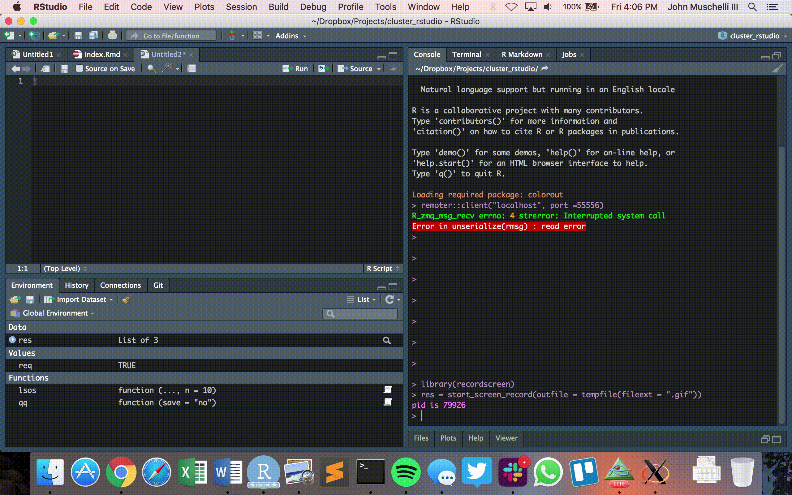

# How do I use RStudio and JHPCE
The goal of this report is to allow users to edit and send code from the RStudio IDE to a cluster compute node with `R`.  

What this tutorial is not:

1) How to use RStudio on the JHPCE (see https://jhpce.jhu.edu/question/how-do-i-get-the-rstudio-program-to-work-on-the-cluster/)
2) How to get the cluster on the `Console` portion of RStudio (we use Terminal)
3) `knit` documents on the JHPCE.

# Bash Setup 

## Setting up your local aliases

```bash
## In local .bashrc file
export jhpce_username="YOUR USERNAME"
alias jhpce="ssh -Y -X ${jhpec_username}@jhpce01.jhsph.edu"
```

Make sure you run all the following commands in another new Terminal or run `source ~/.bashrc`.  

## Passwordless Logins

See https://jhpce.jhu.edu/knowledge-base/authentication/ssh-key-setup/ on how to create passwordless logins.  This is much more in detail than this document and also covers Windows machines.  The gist of what's going on is below, but seriously, go to that link.

1.  If you've already done this once before you should **NOT** do it again.  This is done locally. Create your public/private keys using `ssh-keygen -t rsa`. Change to your `.ssh` directory with `cd ~/.ssh`. There should be a file `id_rsa.pub` which is your public key file..
2.  Note, before running this command `IDENTIFIER` should be changed.  Copy your public key to JHPCE, using `scp`:

`cat ~/.ssh/id_rsa.pub | ssh ${jhpec_username}@jhpce01.jhsph.edu 'cat >> ~/.ssh/authorized_keys'`
where you can replace `IDENTIFIER` with the name of your computer. 

Now you should be able to run:

```bash
jhpce
```
and log in without a password (or your passphrase).


## Logging into a node with one command

Now we will set up an alias locally so you can log into JHPCE, and autotmatically `qrsh` into a node.  Here `qr` will run logging in and `qrsh` with default options.  If you want to change the options, such as `qrsh -l mem_free=30G,h_vmem=30G`, then the `qrsh` (local) function below will allow you to do that:

```bash
## In local .bashrc file
alias qr="jhpce -t 'source /etc/profile; qrsh'"
qrsh () { 
    echo "qrsh requests were: $@";
    cmd="source /etc/profile; qrsh $@";
    jhpce -t $cmd
}
```

Now, you should be able to go into your **new** Terminal window and run:
```bash
qrsh
```
and be logged into a compute node.

# RStudio

Now, the whole setup above allowed you to 1) log into a node with one command, and 2) have X11 forwarding on with `-X` and `-Y` in the `ssh` command.  The forwarding is important so we can do plots.  You need to make sure you have the most up-to-date RStudio to use the Terminals.

## A new Terminal

Now in RStudio, go to `Tools → Terminal → New Terminal` or `Alt+Shift+R`.  The Terminal window should pop up.  Run `qrsh` in the Terminal, make sure you're on a compute node.  Then run `R` as you normally would on JHPCE.  Now, you have the RStudio editor and an interactive `R` session within RStudio.  

Run 
```r
plot(0, 0)
```
to see if X11 is forwarded correctly.

## How should this look



## Other Resources/Options

https://www.rdocumentation.org/packages/rmote/versions/0.3.4
https://cran.r-project.org/package=remoter


